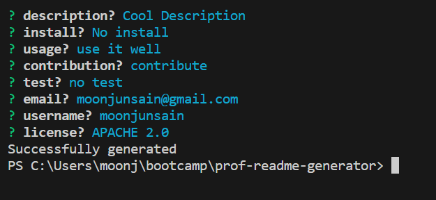

# prof-readme-generator

## Technology Used
- javascript
- inquirer
- nodejs


## Description 
This is a product of a challenge provided by UC Berkeley Extension Coding Bootcamp

This is for generating a readme.md file.
The user can generate readme file by answering to the prompt after running 
```
node index.js
```
in the directory

This was done while trying to accomplish following criteria:

### Acceptance Criteria
    GIVEN a command-line application that accepts user input
    WHEN I am prompted for information about my application repository
    THEN a high-quality, professional README.md is generated with the title of my project and sections entitled Description, Table of Contents, Installation, Usage, License, Contributing, Tests, and Questions
    WHEN I enter my project title
    THEN this is displayed as the title of the README
    WHEN I enter a description, installation instructions, usage information, contribution guidelines, and test instructions
    THEN this information is added to the sections of the README entitled Description, Installation, Usage, Contributing, and Tests
    WHEN I choose a license for my application from a list of options
    THEN a badge for that license is added near the top of the README and a notice is added to the section of the README entitled License that explains which license the application is covered under
    WHEN I enter my GitHub username
    THEN this is added to the section of the README entitled Questions, with a link to my GitHub profile
    WHEN I enter my email address
    THEN this is added to the section of the README entitled Questions, with instructions on how to reach me with additional questions
    WHEN I click on the links in the Table of Contents
    THEN I am taken to the corresponding section of the README


### Video Demo
https://drive.google.com/file/d/1QJwTsUg0p3GMjA9j0LGbjkGPtSomOWR_/view 


## Table of Contents


* [Installation](#installation)
* [Usage](#usage)
* [Learning Points](#learning-points)
* [Credits](#credits)
* [License](#license)


## Installation

```
npm i
```


## Usage 

Following is the screenshot of the app.
The user can answer the prompt then the readme file will be generated after the name "generatedREADME.md"




## Learning Points
1. working with nodejs and running js through terminal
2. using string template literal to make the concatenation easier


## Credits

### June Moon
- Email: moonjunsain@gmail.com
- [Github](https://github.com/moonjunsain)
- [Linkedin](https://www.linkedin.com/in/june-moon-940538280/)


## License

MIT License

---


© 2023 edX Boot Camps LLC. Confidential and Proprietary. All Rights Reserved.